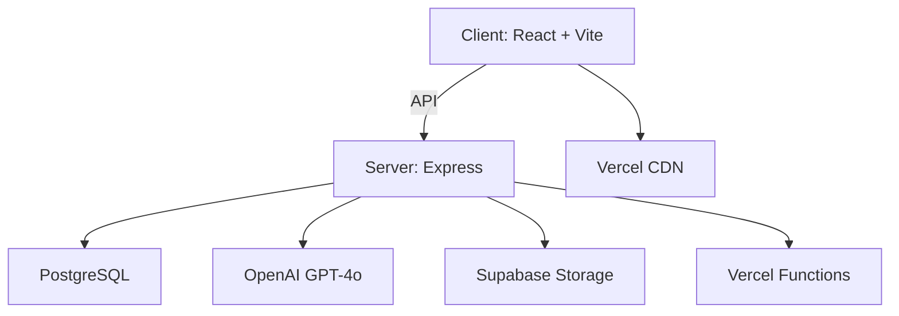

# Architecture Audit Report
**Date**: February 10, 2026
**Auditor**: Claude Sonnet 4.5
**Project**: RFP Proposals Platform
**Version**: 1.0.0
**Codebase Size**: ~23,000 LOC across 145+ files

---

## Executive Summary

This is an **enterprise-grade RFP/Proposal management and AI-powered content platform** built as a TypeScript monorepo. The application combines a modern React frontend with an Express backend, PostgreSQL database, and multiple OpenAI GPT-4o integrations. It's deployed on Vercel with a hybrid architecture (static frontend + serverless API).

**Scale**: ~95 client files, 21 services, 17 routes, 3.4MB production build, 513 React hooks usage across 56 components

**Overall Assessment**: ⭐⭐⭐⭐☆ (4/5) - Production-grade with identified areas for improvement

---

## Table of Contents

1. [Project Structure & Organization](#1-project-structure--organization)
2. [Frontend Architecture](#2-frontend-architecture-react--vite--tailwind)
3. [Backend Architecture](#3-backend-architecture-express--openai)
4. [Database Schema](#4-database-schema-postgresql--drizzle-orm)
5. [Authentication & Security](#5-authentication--session-management)
6. [AI Integration](#6-ai-integration-architecture)
7. [Deployment Architecture](#7-deployment-architecture-vercel)
8. [Data Flow & Lifecycle](#8-data-flow--request-lifecycle)
9. [Key Strengths](#9-key-strengths)
10. [Critical Issues & Fixes](#10-critical-issues--recommendations)
11. [Scalability Assessment](#11-scalability-assessment)
12. [Security Posture](#12-security-posture)
13. [Developer Experience](#13-developer-experience)
14. [Performance Profile](#14-performance-profile)
15. [Technology Stack Review](#15-technology-assessment)
16. [Documentation Status](#16-documentation-status)
17. [Action Items](#17-action-items-prioritized)

---

## 1. Project Structure & Organization

### Monorepo Architecture
```
rfp-proposals/
├── packages/
│   ├── client/          # React + Vite + Tailwind
│   └── server/          # Express + OpenAI + Drizzle ORM
├── api/                 # Vercel serverless entry point
└── storage/             # Local file storage (photos, avatars)
```

**Status**: ✅ Clean separation of concerns

**Issues Identified**:
- ⚠️ Duplicate dependencies between root and packages (bcrypt/bcryptjs)
- ⚠️ `api/index.ts` is a massive 100+ line serverless entrypoint that duplicates server logic

**Files**:
- Root: `package.json`, `vercel.json`
- Client: `packages/client/package.json`, `vite.config.ts`, `tailwind.config.js`
- Server: `packages/server/package.json`, `drizzle.config.ts`

---

## 2. Frontend Architecture (React + Vite + Tailwind)

### Tech Stack
- **Framework**: React 18.3 with TypeScript
- **Build Tool**: Vite 6.0
- **Styling**: Tailwind CSS 3.4 with shadcn/ui components
- **Routing**: React Router v6
- **Rich Text**: TipTap (ProseMirror-based) for Document Studio
- **Icons**: lucide-react
- **State Management**: React Context + custom hooks (no Redux/Zustand)

### Component Architecture

**17 Pages** (lazy-loaded):
- Core: `HomePage.tsx`, `Login.tsx`, `ChangePassword.tsx`
- Content: `ImportWizard.tsx`, `PhotoUpload.tsx`, `SearchLibrary.tsx`, `ManualEntry.tsx`
- AI Tools: `AskAI.tsx`, `RFPAnalyzer.tsx`, `ProposalInsights.tsx`, `CaseStudies.tsx`, `UnifiedAI.tsx`
- Document: `DocumentStudio.tsx` (sophisticated rich text editor)
- Utility: `SavedDocuments.tsx`, `Help.tsx`, `Support.tsx`, `Settings.tsx`

**Key Component Patterns**:
1. **AI Chat Interface** - Reusable across 4 pages
   - Components: `ChatContainer.tsx`, `ChatInput.tsx`, `ChatMessage.tsx`, `ChatHistorySidebar.tsx`
   - Pattern: Empty state → Conversation mode → Persistent history

2. **Document Studio** - Full-featured editor
   - TipTap editor with bubble menu, slash commands, inline AI
   - Panels: Asset, Photo, Q&A, Inspector, Version History
   - Features: Export (PDF/DOCX), Share, Find/Replace

3. **Guided Tour** - `GuidedTour.tsx`, `TourTooltip.tsx`
   - Step-by-step onboarding
   - Completion state in DB

### State Management
- **Global**: 2 Context Providers (`AuthContext`, `ThemeContext`)
- **Local**: 513 hook usages across 56 files
- **Custom Hooks**: `useChat`, `useDocumentStore`, `useCompanionBehavior`, `usePanelResize`, `useToast`

**Status**: ✅ Appropriate for complexity, no over-engineering

**Issues**:
- ⚠️ Some components have complex local state (DocumentStudio ~100+ lines of hooks)
- ⚠️ No client-side caching (API calls repeated on mount)

**Files**:
- Main: `packages/client/src/App.tsx`
- Contexts: `packages/client/src/contexts/`
- Hooks: `packages/client/src/hooks/`
- Pages: `packages/client/src/pages/`
- Components: `packages/client/src/components/`

---

## 3. Backend Architecture (Express + OpenAI)

### Server Stack
- **Runtime**: Node.js with TypeScript (tsx for dev, tsc for build)
- **Framework**: Express 4.18
- **Database**: PostgreSQL via Drizzle ORM
- **AI**: OpenAI SDK 6.16 (GPT-4o)
- **File Processing**: mammoth (DOCX), pdf-parse (PDF), xlsx (Excel)
- **Security**: helmet, express-rate-limit, bcrypt/bcryptjs
- **Session**: express-session (local) + custom HMAC tokens (Vercel)

### Route Structure (17 routes)
```
/api/
├── auth          # Login, logout, status, avatar, password
├── health        # Unauthenticated health check
├── topics        # Controlled vocabulary
├── answers       # Q&A library CRUD + versioning
├── photos        # Photo assets + linking
├── search        # Full-text search
├── import        # Excel/Loopio import
├── rfp           # RFP document analysis
├── proposals     # Proposal data sync
├── ai            # Q&A library AI
├── unified-ai    # Multi-feature AI
├── client-success# Case studies/testimonials
├── conversations # Chat history
├── studio        # Document editor AI
├── companion     # AI assistant
└── feedback      # User feedback
```

### Service Layer (21 services)

**AI Services** (7 independent):
1. `aiService.ts` - Q&A library RAG
2. `proposalAIService.ts` - Proposal analytics
3. `caseStudyAIService.ts` - Case study insights
4. `unifiedAIService.ts` - Combined AI
5. `companionAIService.ts` - Floating assistant
6. `documentAIService.ts` - Document generation
7. `briefingAIService.ts` - RFP briefing

**Pattern**: Lazy-initialized OpenAI client
```typescript
let openaiClient: OpenAI | null = null
function getOpenAI(): OpenAI | null {
  if (!process.env.OPENAI_API_KEY) return null
  if (!openaiClient) {
    openaiClient = new OpenAI({ apiKey: process.env.OPENAI_API_KEY })
  }
  return openaiClient
}
```

**Data Services**:
- `answerService.ts`, `photoService.ts`, `topicService.ts`
- `linkService.ts`, `documentService.ts`, `userService.ts`

**Sync Services**:
- `proposalSyncService.ts` - Auto-sync from Excel (polling every 5min)
- `pipelineSyncService.ts` - RFP intake log sync
- `importService.ts` - Manual import

**Utility Services**:
- `auditService.ts`, `avatarService.ts`, `streamHelper.ts`

**Status**: ✅ Well-organized, clear separation

**Issues**:
- ⚠️ Some services very large (proposalAIService.ts has complex analytics)
- ⚠️ Polling could be replaced with webhooks

**Files**:
- Entry: `packages/server/src/index.ts`
- Routes: `packages/server/src/routes/`
- Services: `packages/server/src/services/`
- Middleware: `packages/server/src/middleware/`

---

## 4. Database Schema (PostgreSQL + Drizzle ORM)

### Tables (19 total)

**Core Content Library**:
```sql
users                      # Multi-user auth
topics                     # Controlled vocabulary
answer_items               # Q&A library (current)
answer_item_versions       # Version history
photo_assets               # Photo library (current)
photo_asset_versions       # Version history
links_answer_photo         # Many-to-many linking
```

**Proposal Data**:
```sql
proposals                  # Synced from Excel
proposal_pipeline          # RFP intake log
proposal_sync_log          # Sync tracking
```

**Client Success**:
```sql
client_success_entries     # Case studies
client_success_results     # Metrics
client_success_testimonials# Quotes
client_success_awards      # Awards
```

**Document Studio**:
```sql
studio_documents           # Rich text docs
studio_document_versions   # Version history
studio_templates           # Templates
studio_assets              # User assets
```

**System**:
```sql
saved_documents            # Uploaded docs
conversations              # AI chat history
audit_log                  # Action tracking
```

### Schema Patterns

1. **Versioning** - Current state + versions table with cascade deletes
2. **Fingerprinting** - Unique constraints for deduplication (answers, proposals)
3. **JSONB** - Flexible data (tags, messages, formatSettings)
4. **Soft References** - `userId: text` (no foreign keys to users)

**Status**: ✅ Well-designed, proper normalization

**Issues**:
- 🔴 **Missing indexes** on frequently queried columns (`conversations.userId`, `answer_items.topicId`)
- ⚠️ Some nullable fields could have better constraints
- ⚠️ No foreign keys to users table (soft references)

**Files**:
- Schema: `packages/server/src/db/schema.ts`
- Connection: `packages/server/src/db/index.ts`
- Config: `packages/server/drizzle.config.ts`

---

## 5. Authentication & Session Management

### Dual-Mode Auth

**Local Development** (express-session):
```typescript
session({
  secret: process.env.SESSION_SECRET,
  cookie: {
    secure: false,
    httpOnly: true,
    maxAge: 4 * 60 * 60 * 1000  // 4 hours
  }
})
```

**Vercel Production** (stateless HMAC):
- Session data signed with HMAC-SHA256
- Stored in `rfp-session` cookie
- No Redis/database needed
- ⚠️ Cookie size limit: 4KB

### User Management
- **Users**: eric.yerke, becky.morehouse, lindsey.cook @stamats.com
- **Validation**: Only @stamats.com emails
- **Password Policy**: Forced change on first login
- **Hashing**: bcrypt (10 rounds)
- **Avatars**: Upload + crop, stored in `/storage/avatars/`

### Auth Middleware
```typescript
requireAuth(req, res, next) {
  if (req.path === "/health") return next()
  if (req.session?.authenticated) return next()
  return res.status(401).json({ error: "Authentication required" })
}
```

**Status**: ✅ Secure implementation

**Issues**:
- 🔴 **No CSRF protection** (XSS could hijack sessions)
- 🔴 **No rate limiting** on login endpoint (brute force risk)
- ⚠️ Session timeout not configurable per-user

**Files**:
- Middleware: `packages/server/src/middleware/auth.ts`
- Routes: `packages/server/src/routes/auth.ts`
- Service: `packages/server/src/services/userService.ts`
- Client Context: `packages/client/src/contexts/AuthContext.tsx`

---

## 6. AI Integration Architecture

### 7 Isolated AI Systems

Each with independent prompt engineering and data loading:

1. **Q&A Library AI** (`aiService.ts`)
   - Pattern: RAG (Retrieval-Augmented Generation)
   - Data: `answer_items` + `photo_assets`
   - Refusal: Returns `refused: true` if no content found
   - Follow-ups: Parses `FOLLOW_UP_PROMPTS: [...]`

2. **Proposal Insights AI** (`proposalAIService.ts`)
   - Pattern: Data analytics
   - Data: All `proposals` + `proposal_pipeline`
   - Features: Win rate, trends, momentum, YoY
   - Charts: GPT-4o generates JSON chart data

3. **Case Study AI** (`caseStudyAIService.ts`)
   - Pattern: RAG on case studies
   - Data: `clientSuccessData` + `client_success_entries`

4. **Unified AI** (`unifiedAIService.ts`)
   - Pattern: Multi-mode routing
   - Routes to appropriate sub-service

5. **Companion AI** (`companionAIService.ts`)
   - Pattern: Context-aware assistant
   - Page-specific help

6. **Document AI** (`documentAIService.ts`)
   - Pattern: Generation
   - Template filling, drafting

7. **Briefing AI** (`briefingAIService.ts`)
   - Pattern: Analysis
   - RFP insights extraction

### Shared Utilities
- **Streaming**: `streamHelper.ts` for SSE
- **Context**: `truncateHistory()` prevents overflow
- **Charts**: `CHART_PROMPT` + `parseChartData()`

**Status**: ✅ Sophisticated, well-isolated

**Issues**:
- 🔴 **No token counting** (could hit 128k context limit)
- ⚠️ **No caching** (every query reloads all data)
- ⚠️ **No embeddings** (keyword search only, not semantic)

**Files**:
- Services: `packages/server/src/services/*AIService.ts`
- Utils: `packages/server/src/services/utils/streamHelper.ts`
- Routes: `packages/server/src/routes/ai.ts`, `unified-ai.ts`, etc.

---

## 7. Deployment Architecture (Vercel)

### Hybrid Model

**Static Frontend**:
- Built with Vite (`npm run vercel-build`)
- Output: `packages/client/dist` (3.4MB)
- CDN distribution
- Client-side routing

**Serverless API**:
- Entry: `/api/index.ts` (Vercel Function)
- Max duration: 30s
- Cold start: ~1-2s

### Configuration
```json
{
  "buildCommand": "npm run vercel-build",
  "outputDirectory": "packages/client/dist",
  "functions": { "api/**/*.ts": { "maxDuration": 30 } },
  "rewrites": [
    { "source": "/api/:path*", "destination": "/api" },
    { "source": "/((?!api).*)", "destination": "/" }
  ]
}
```

### Environment Variables
Required:
- `DATABASE_URL` (PostgreSQL)
- `OPENAI_API_KEY` (GPT-4o)
- `SESSION_SECRET` (HMAC signing)
- `SUPABASE_URL` + `SUPABASE_ANON_KEY` (Storage)

### Security Headers
```
X-Content-Type-Options: nosniff
X-Frame-Options: DENY
X-XSS-Protection: 1; mode=block
Referrer-Policy: strict-origin-when-cross-origin
Strict-Transport-Security: max-age=31536000
```

**Status**: ✅ Modern serverless architecture

**Issues**:
- ⚠️ Single function handles all routes (slower cold starts)
- ⚠️ No edge functions (auth could be faster at edge)
- ⚠️ 30s timeout may be short for large AI responses

**Files**:
- Config: `vercel.json`
- Entry: `api/index.ts`
- Build script: `package.json` → `vercel-build`

---

## 8. Data Flow & Request Lifecycle

### Typical Request Flow
```
1. User action in React
2. /lib/api.ts helper called
3. fetch() with credentials: "include"
4. Proxy (dev) or direct (prod) to /api
5. requireAuth middleware checks session
6. Route handler processes
7. Service layer executes logic
8. Drizzle ORM queries PostgreSQL
9. JSON response
10. React state update
11. UI re-render
```

### AI Request Flow
```
1. User sends chat message
2. ChatInput → /api/ai or /api/unified-ai
3. Service loads data from DB
4. Context string built (data + system prompt)
5. OpenAI streaming API called
6. SSE stream to client
7. ChatMessage renders incrementally
8. Follow-ups extracted
9. Conversation saved to DB
```

### Excel Import Flow
```
1. User uploads in ImportWizard
2. multipart/form-data → /api/import/preview
3. Server extracts buffer (custom Vercel parser)
4. xlsx parses spreadsheet
5. importService validates, deduplicates (fingerprints)
6. Preview returned (issues + counts)
7. User confirms
8. /api/import/confirm
9. Drizzle ORM upserts
10. answerItemVersions created
11. Success summary
```

### State Sync Patterns
- **Optimistic Updates**: ❌ Not used
- **Polling**: ✅ Excel sync every 5 minutes
- **Real-time**: ❌ Not implemented
- **Cache**: ⚠️ Minimal (no React Query/SWR)

**Status**: ✅ Simple and reliable

**Issues**:
- ⚠️ No client-side caching (repeated calls)
- ⚠️ No optimistic UI (feels slower)
- ⚠️ Polling could be webhooks

---

## 9. Key Strengths

### ✅ Architecture Strengths
1. Clean separation of concerns (client/server/services)
2. Type-safe end-to-end (TypeScript everywhere)
3. Modern tech stack (React 18, Vite 6, Tailwind 3)
4. Sophisticated AI integration (7 isolated services with RAG)
5. Rich document editing (TipTap Studio with collab features)
6. Comprehensive versioning (answers, photos, docs)
7. Proper security (bcrypt, helmet, HttpOnly cookies)
8. Serverless-ready (Vercel with stateless sessions)
9. Extensive component library (95 files, reusable patterns)
10. Audit trail (logging, version history, attribution)

### ✅ UX Strengths
1. Consistent AI chat interface across tools
2. Lazy loading for fast initial load
3. Dark mode support
4. Keyboard shortcuts
5. Guided tour onboarding
6. Contextual help system
7. Toast notifications
8. Empty states with suggested actions

---

## 10. Critical Issues & Recommendations

### 🔴 High Priority (Fix Immediately)

#### Issue #1: Session CSRF Vulnerability
**Location**: `packages/server/src/middleware/auth.ts`, all write routes
**Risk**: Session hijacking via XSS → unauthorized actions
**Impact**: Security breach, data manipulation

**Fix**:
```typescript
// Add express-csrf-token
import csrf from 'express-csrf-token';
app.use(csrf());

// In forms, include CSRF token
<input type="hidden" name="_csrf" value={csrfToken} />
```

**Estimated Time**: 2-3 hours
**Priority**: 🔴 CRITICAL

---

#### Issue #2: Missing Rate Limiting on Auth
**Location**: `packages/server/src/routes/auth.ts` → POST `/login`
**Risk**: Brute force password attacks
**Impact**: Account compromise

**Fix**:
```typescript
import rateLimit from 'express-rate-limit';

const loginLimiter = rateLimit({
  windowMs: 15 * 60 * 1000, // 15 minutes
  max: 5, // 5 attempts
  message: 'Too many login attempts, please try again later'
});

router.post('/login', loginLimiter, async (req, res) => { ... });
```

**Estimated Time**: 30 minutes
**Priority**: 🔴 CRITICAL

---

#### Issue #3: Database Missing Indexes
**Location**: `packages/server/src/db/schema.ts`
**Risk**: Slow queries as data grows
**Impact**: Poor performance, timeout errors

**Fix**:
```sql
-- Add these indexes
CREATE INDEX idx_conversations_user_id ON conversations(user_id);
CREATE INDEX idx_conversations_page ON conversations(page);
CREATE INDEX idx_answer_items_topic_id ON answer_items(topic_id);
CREATE INDEX idx_answer_items_status ON answer_items(status);
CREATE INDEX idx_photo_assets_topic_id ON photo_assets(topic_id);
CREATE INDEX idx_proposals_category ON proposals(category);
CREATE INDEX idx_proposals_won ON proposals(won);
CREATE INDEX idx_proposals_date ON proposals(date);
```

**Drizzle ORM approach**:
```typescript
// In schema.ts
export const conversations = pgTable("conversations", {
  // ... fields
}, (table) => ({
  userIdIdx: index("idx_conversations_user_id").on(table.userId),
  pageIdx: index("idx_conversations_page").on(table.page),
}));
```

**Estimated Time**: 1-2 hours (add indexes + test)
**Priority**: 🔴 CRITICAL

---

#### Issue #4: AI Token Overflow Risk
**Location**: All AI services (`*AIService.ts`)
**Risk**: Context limit errors (128k tokens for GPT-4o)
**Impact**: AI failures, poor UX

**Fix**:
```typescript
import { encoding_for_model } from 'tiktoken';

function countTokens(text: string): number {
  const encoding = encoding_for_model('gpt-4o');
  const tokens = encoding.encode(text);
  encoding.free();
  return tokens.length;
}

// Before sending to OpenAI
const systemTokens = countTokens(systemPrompt);
const historyTokens = messages.reduce((sum, m) => sum + countTokens(m.content), 0);
const totalTokens = systemTokens + historyTokens;

if (totalTokens > 120000) { // Leave 8k for response
  // Truncate history or summarize
  messages = truncateHistory(messages, 120000 - systemTokens);
}
```

**Install**: `npm install tiktoken`
**Estimated Time**: 2-3 hours (implement + test all AI services)
**Priority**: 🔴 CRITICAL

---

#### Issue #5: Cookie Size Limit Risk
**Location**: `api/index.ts` → session token generation
**Status**: Already addressed (avatars use URLs not base64)
**Verification**: ✅ Confirm no large data in session

**Action**: Document this pattern in README
**Estimated Time**: 15 minutes
**Priority**: 🟢 DOCUMENTATION

---

### 🟡 Medium Priority (Plan for Next Sprint)

#### Issue #6: No Client-Side Caching
**Location**: All API calls in `packages/client/src/`
**Impact**: Slower UX, higher server load

**Fix**: Implement React Query
```typescript
// Install
npm install @tanstack/react-query

// Setup
import { QueryClient, QueryClientProvider } from '@tanstack/react-query';
const queryClient = new QueryClient();

// Usage
const { data, isLoading } = useQuery({
  queryKey: ['answers', topicId],
  queryFn: () => importApi.getAnswers(topicId)
});
```

**Estimated Time**: 4-6 hours
**Priority**: 🟡 MEDIUM

---

#### Issue #7: Large Serverless Function
**Location**: `api/index.ts` (single function handles all routes)
**Impact**: Slow cold starts (~1-2s)

**Fix**: Split into multiple Vercel Functions
```
api/
├── auth.ts        # Auth routes
├── ai.ts          # AI routes
├── data.ts        # CRUD routes
└── files.ts       # Upload routes
```

Update `vercel.json`:
```json
{
  "functions": {
    "api/auth.ts": { "maxDuration": 10 },
    "api/ai.ts": { "maxDuration": 30 },
    "api/data.ts": { "maxDuration": 10 }
  }
}
```

**Estimated Time**: 3-4 hours
**Priority**: 🟡 MEDIUM

---

#### Issue #8: No Real-Time Collaboration
**Location**: `DocumentStudio.tsx`
**Impact**: Risk of overwriting work in shared docs

**Fix**: Implement Yjs + WebSocket
```typescript
// Install
npm install yjs y-websocket @tiptap/extension-collaboration

// Setup collaborative editing
import { Collaboration } from '@tiptap/extension-collaboration';
import * as Y from 'yjs';
import { WebsocketProvider } from 'y-websocket';

const ydoc = new Y.Doc();
const provider = new WebsocketProvider('wss://your-server.com', 'doc-id', ydoc);

const editor = useEditor({
  extensions: [
    StarterKit,
    Collaboration.configure({ document: ydoc })
  ]
});
```

**Estimated Time**: 8-10 hours (setup WebSocket server + client)
**Priority**: 🟡 MEDIUM

---

#### Issue #9: No Embeddings for Semantic Search
**Location**: `packages/server/src/services/answerService.ts` → `searchAnswers()`
**Impact**: Misses semantically similar content

**Fix**: Add pgvector + OpenAI embeddings
```sql
-- Enable pgvector
CREATE EXTENSION vector;

-- Add embedding column
ALTER TABLE answer_items ADD COLUMN embedding vector(1536);

-- Create index
CREATE INDEX ON answer_items USING ivfflat (embedding vector_cosine_ops);
```

```typescript
// Generate embeddings on insert/update
const response = await openai.embeddings.create({
  model: 'text-embedding-3-small',
  input: question + '\n\n' + answer
});
const embedding = response.data[0].embedding;

// Search with embeddings
const results = await db.execute(sql`
  SELECT *, 1 - (embedding <=> ${queryEmbedding}) AS similarity
  FROM answer_items
  WHERE 1 - (embedding <=> ${queryEmbedding}) > 0.7
  ORDER BY similarity DESC
  LIMIT 10
`);
```

**Estimated Time**: 6-8 hours (setup + migration + testing)
**Priority**: 🟡 MEDIUM

---

#### Issue #10: Proposal Sync Polling
**Location**: `packages/server/src/services/proposalSyncService.ts`
**Impact**: Wasted cycles, 5-min delay

**Fix**: Replace with file watcher or webhook
```typescript
// Option 1: File watcher (local dev)
import chokidar from 'chokidar';

const watcher = chokidar.watch('/path/to/excel/file.xlsx');
watcher.on('change', async (path) => {
  console.log(`File ${path} changed, syncing...`);
  await syncProposals();
});

// Option 2: Webhook (production)
// Configure Excel file to trigger webhook on save
router.post('/webhook/proposal-sync', async (req, res) => {
  await syncProposals();
  res.json({ success: true });
});
```

**Estimated Time**: 2-3 hours
**Priority**: 🟡 MEDIUM

---

### 🟢 Low Priority (Technical Debt)

#### Issue #11: Duplicate Dependencies
**Location**: Root `package.json` vs `packages/server/package.json`
**Impact**: Increased bundle size, confusion

**Fix**: Consolidate to bcryptjs everywhere
```bash
# Remove from root
npm uninstall bcrypt bcryptjs

# Ensure server uses bcryptjs
cd packages/server
npm uninstall bcrypt
npm install bcryptjs
```

**Estimated Time**: 30 minutes
**Priority**: 🟢 LOW

---

#### Issue #12: Large Component Files
**Location**: `DocumentStudio.tsx` (>200 lines), `proposalAIService.ts` (>200 lines)
**Impact**: Hard to maintain

**Fix**: Extract sub-components and utilities
```typescript
// Extract from DocumentStudio.tsx
// DocumentStudio.tsx → main component
// DocumentStudioToolbar.tsx
// DocumentStudioSidebar.tsx
// DocumentStudioModals.tsx
// useDocumentStudioState.ts (custom hook)
```

**Estimated Time**: 4-6 hours
**Priority**: 🟢 LOW

---

#### Issue #13: No Unit Tests
**Location**: `packages/server/src/__tests__/` (empty stubs)
**Impact**: Risk of regressions

**Fix**: Add Vitest tests
```typescript
// Example: answerService.test.ts
import { describe, it, expect, beforeEach } from 'vitest';
import { searchAnswers, createAnswer } from '../services/answerService';

describe('answerService', () => {
  beforeEach(async () => {
    // Setup test DB
  });

  it('should search answers by keyword', async () => {
    const results = await searchAnswers('test query');
    expect(results).toHaveLength(5);
  });

  it('should create answer with fingerprint', async () => {
    const answer = await createAnswer({ ... });
    expect(answer.fingerprint).toBeDefined();
  });
});
```

**Estimated Time**: 10-15 hours (cover all services)
**Priority**: 🟢 LOW

---

#### Issue #14: No E2E Tests
**Location**: Playwright configured but no tests
**Impact**: Manual testing required

**Fix**: Add smoke tests
```typescript
// tests/smoke.spec.ts
import { test, expect } from '@playwright/test';

test('login flow', async ({ page }) => {
  await page.goto('/login');
  await page.fill('[name="email"]', 'eric.yerke@stamats.com');
  await page.fill('[name="password"]', 'test123');
  await page.click('button[type="submit"]');
  await expect(page).toHaveURL('/');
});

test('create answer', async ({ page }) => {
  // Login first
  await page.goto('/new');
  await page.fill('[name="question"]', 'Test question?');
  await page.fill('[name="answer"]', 'Test answer');
  await page.click('button:has-text("Save")');
  await expect(page.locator('text=Saved successfully')).toBeVisible();
});
```

**Estimated Time**: 8-10 hours
**Priority**: 🟢 LOW

---

#### Issue #15: Hard-Coded Client Success Data
**Location**: `packages/server/src/data/clientSuccessData.ts` (964 lines)
**Impact**: Hard to update, version control noise

**Fix**: Move to database or JSON file
```typescript
// Option 1: JSON file
import clientSuccessData from './clientSuccessData.json';

// Option 2: Database seed
// Create migration to insert data
// Run: npm run db:seed
```

**Estimated Time**: 2-3 hours
**Priority**: 🟢 LOW

---

## 11. Scalability Assessment

### Current Capacity
- **Users**: 3 (eric, becky, lindsey)
- **Database**: Single PostgreSQL instance
- **Sessions**: Stateless (cookie-based)
- **Storage**: Supabase (production)
- **AI**: OpenAI API (rate limited)

### Bottlenecks at Scale

**100 users**:
- ✅ Frontend: No issue (CDN)
- ✅ API: Auto-scales
- ⚠️ Database: May need pooling (Supabase provides)
- ⚠️ AI: Rate limits (60 req/min)

**1,000 users**:
- ⚠️ Database: Need read replicas
- ⚠️ AI: Need caching (Redis)
- ⚠️ Sessions: Cookie size issue

**10,000 users**:
- 🔴 Database: Need sharding/multi-region
- 🔴 AI: Need own inference
- 🔴 Storage: Need CDN

### Scaling Recommendations
1. Add PgBouncer connection pooling
2. Implement Redis for AI response caching
3. Move photos to Cloudflare R2 + CDN
4. Add observability (Winston + Sentry)
5. Run load tests (k6 or Artillery)

**Estimated Time**: 20-30 hours for full scaling prep
**Priority**: 🔵 FUTURE (when approaching 100 users)

---

## 12. Security Posture

### ✅ Current Security Measures
- Password hashing (bcrypt, 10 rounds)
- HttpOnly cookies (XSS protection)
- Secure flag (HTTPS only in prod)
- Helmet.js security headers
- Zod validation
- SQL injection protection (Drizzle ORM)
- XSS protection (React + DOMPurify)

### 🔴 Security Gaps (Must Fix)
1. **No CSRF protection** → Add tokens (Issue #1)
2. **No rate limiting** → Add express-rate-limit (Issue #2)
3. **No input sanitization** → Add DOMPurify server-side
4. **Session timeout not configurable** → Add sliding expiration
5. **No 2FA** → Consider for admin users
6. **No Content Security Policy** → Add CSP headers

### Recommended Additions
```typescript
// 1. CSRF (Issue #1)
import csrf from 'express-csrf-token';
app.use(csrf());

// 2. Rate limiting (Issue #2)
import rateLimit from 'express-rate-limit';
app.use('/api/', rateLimit({ windowMs: 15 * 60 * 1000, max: 100 }));

// 3. Server-side sanitization
import DOMPurify from 'isomorphic-dompurify';
const clean = DOMPurify.sanitize(userInput);

// 4. CSP headers
app.use(helmet({
  contentSecurityPolicy: {
    directives: {
      defaultSrc: ["'self'"],
      scriptSrc: ["'self'", "'unsafe-inline'"],
      styleSrc: ["'self'", "'unsafe-inline'"],
      imgSrc: ["'self'", "data:", "https:"],
    }
  }
}));

// 5. Sliding session expiration
app.use((req, res, next) => {
  if (req.session.authenticated) {
    req.session.cookie.maxAge = 4 * 60 * 60 * 1000; // Refresh 4hr
  }
  next();
});
```

**Estimated Time**: 4-6 hours
**Priority**: 🔴 CRITICAL (items 1-3), 🟡 MEDIUM (items 4-5)

### Compliance Notes
- **GDPR**: Need data export/deletion flows
- **SOC 2**: Audit logging partially implemented
- **HIPAA**: NOT compliant (no encryption at rest, no BAA with OpenAI)

---

## 13. Developer Experience

### ✅ DX Strengths
- Hot reload (Vite + tsx watch)
- Type safety (TypeScript strict)
- Monorepo (npm workspaces)
- Consistent code style
- Clear folder structure
- Type-safe API client

### 🟡 DX Pain Points
- No tests (hard to refactor)
- Large service files (hard to navigate)
- No API docs (need OpenAPI)
- No Storybook (components hard to preview)
- Manual migrations (need automation)

### Recommendations
1. Add Vitest tests (Issue #13)
2. Add Playwright E2E (Issue #14)
3. Generate OpenAPI docs from Zod
4. Set up Storybook
5. Use Drizzle Kit for migrations

**Example: OpenAPI from Zod**
```typescript
import { z } from 'zod';
import { generateOpenApi } from '@asteasolutions/zod-to-openapi';

const LoginSchema = z.object({
  email: z.string().email(),
  password: z.string().min(8)
});

// Auto-generate docs
const openapi = generateOpenApi(schemas);
```

**Estimated Time**: 12-16 hours
**Priority**: 🟡 MEDIUM

---

## 14. Performance Profile

### Current Metrics
- **Client build**: 3.4MB (chunked, lazy-loaded)
- **Build time**: ~30-60s
- **Initial load**: <1s (static HTML/CSS)
- **Time to interactive**: ~2s
- **API latency**: 100-500ms
- **AI response**: 5-15s (streaming)

### Optimization Opportunities
1. **Preload critical routes** (HomePage, Login)
2. **Image optimization** (WebP, lazy load)
3. **Service worker** (offline support)
4. **Bundle analysis** (identify large deps)
5. **Query optimization** (add indexes - Issue #3)

**Bundle Analysis**:
```bash
npm run build -- --analyze
# Review largest chunks
```

**Image Optimization**:
```typescript
// Add to vite.config.ts
import viteImagemin from 'vite-plugin-imagemin';

export default defineConfig({
  plugins: [
    viteImagemin({
      gifsicle: { optimizationLevel: 3 },
      mozjpeg: { quality: 75 },
      pngquant: { quality: [0.65, 0.9] },
      webp: { quality: 75 }
    })
  ]
});
```

**Estimated Time**: 6-8 hours
**Priority**: 🟡 MEDIUM

---

## 15. Technology Assessment

### Dependency Review

**Update Needed**:
```json
{
  "openai": "6.16.0" → "4.x" (latest, breaking changes),
  "drizzle-orm": "0.29.5" → "0.35+" (latest)
}
```

**Update Plan**:
```bash
# Check for updates
npm outdated

# Update OpenAI SDK (breaking changes)
npm install openai@latest
# Review: https://github.com/openai/openai-node/releases

# Update Drizzle ORM
npm install drizzle-orm@latest drizzle-kit@latest
```

**Estimated Time**: 4-6 hours (migration + testing)
**Priority**: 🟡 MEDIUM

### Alternative Tech Stack (Future)
- **React** → Solid.js (faster, smaller)
- **Express** → Fastify (faster, better DX)
- **OpenAI API** → Self-hosted Llama 3 (cost savings)
- **PostgreSQL** → ClickHouse (if analytics primary)
- **Vercel** → Cloudflare Pages + Workers (faster cold starts)

**Note**: Not recommended unless specific pain points emerge

---

## 16. Documentation Status

### ✅ Exists
- `MEMORY.md` (architecture patterns, lessons)
- Inline comments in services
- JSDoc in some functions

### ❌ Missing
- README.md (setup instructions)
- CONTRIBUTING.md (dev workflow)
- API documentation (OpenAPI)
- Architecture diagrams (C4 model)
- Deployment guide (Vercel setup)
- Database schema diagrams (ERD)
- Runbook (troubleshooting)

### Documentation Plan

**README.md Template**:
```markdown
# RFP Proposals Platform

## Quick Start
npm install
npm run dev

## Architecture
[Link to architecture doc]

## Setup
1. Copy .env.example → .env
2. Set DATABASE_URL, OPENAI_API_KEY
3. Run migrations: npm run db:push
4. Seed users: npm run seed-users

## Deployment
See DEPLOYMENT.md

## Testing
npm run test
npm run test:e2e
```

**API Documentation**:
```bash
# Generate OpenAPI spec
npm install @asteasolutions/zod-to-openapi swagger-ui-express

# Add route: GET /api/docs
app.use('/api/docs', swaggerUi.serve, swaggerUi.setup(openApiSpec));
```

**Architecture Diagram** (Mermaid):


**Estimated Time**: 8-10 hours
**Priority**: 🟡 MEDIUM

---

## 17. Action Items (Prioritized)

### Week 1: Critical Security & Performance

**Day 1-2: Security Hardening**
- [ ] Add CSRF protection (Issue #1) - 2-3 hours
- [ ] Add rate limiting on login (Issue #2) - 30 minutes
- [ ] Add database indexes (Issue #3) - 1-2 hours
- [ ] Document cookie size limit pattern - 15 minutes

**Day 3-4: AI Improvements**
- [ ] Implement token counting (Issue #4) - 2-3 hours
- [ ] Add AI response caching (basic Redis) - 2-3 hours

**Day 5: Testing & Validation**
- [ ] Test all critical fixes
- [ ] Deploy to staging
- [ ] Security audit verification

**Total**: 12-16 hours

---

### Week 2: Performance & UX

**Day 1-2: Client-Side Caching**
- [ ] Install React Query (Issue #6) - 1 hour
- [ ] Migrate API calls to React Query - 3-4 hours
- [ ] Test and validate - 1 hour

**Day 3-4: Performance Optimization**
- [ ] Run bundle analysis - 1 hour
- [ ] Optimize images (WebP, lazy load) - 2-3 hours
- [ ] Preload critical routes - 1 hour

**Day 5: Monitoring**
- [ ] Add Winston logging - 2 hours
- [ ] Set up Sentry error tracking - 1 hour

**Total**: 12-14 hours

---

### Week 3-4: Developer Experience

**Documentation (4-6 hours)**
- [ ] Write comprehensive README.md
- [ ] Create API documentation (OpenAPI)
- [ ] Add architecture diagrams (Mermaid)
- [ ] Write deployment guide

**Testing (10-12 hours)**
- [ ] Add Vitest unit tests (Issue #13)
- [ ] Add Playwright E2E tests (Issue #14)
- [ ] Set up CI/CD (GitHub Actions)

**Total**: 14-18 hours

---

### Month 2: Advanced Features

**Week 1-2: Real-Time Collaboration (Issue #8)**
- [ ] Set up WebSocket server - 4 hours
- [ ] Integrate Yjs for collaborative editing - 4-6 hours
- [ ] Test multi-user scenarios - 2 hours

**Week 3: Semantic Search (Issue #9)**
- [ ] Set up pgvector extension - 2 hours
- [ ] Generate embeddings for existing data - 2 hours
- [ ] Implement semantic search - 4 hours

**Week 4: Serverless Optimization (Issue #7)**
- [ ] Split API into multiple functions - 3-4 hours
- [ ] Update Vercel config - 1 hour
- [ ] Test cold start improvements - 1 hour

**Total**: 23-28 hours

---

### Ongoing: Technical Debt

**Low Priority Items (as time permits)**
- [ ] Consolidate dependencies (Issue #11) - 30 min
- [ ] Refactor large components (Issue #12) - 4-6 hours
- [ ] Move hardcoded data to DB (Issue #15) - 2-3 hours
- [ ] Replace polling with webhooks (Issue #10) - 2-3 hours

**Total**: 9-13 hours

---

## Summary Checklist

### Immediate (This Week)
- [ ] 🔴 Add CSRF protection
- [ ] 🔴 Add rate limiting on login
- [ ] 🔴 Add database indexes
- [ ] 🔴 Implement token counting for AI

### Short Term (Next 2 Weeks)
- [ ] 🟡 Add React Query for client caching
- [ ] 🟡 Optimize images and bundles
- [ ] 🟡 Write README and API docs
- [ ] 🟡 Add basic unit tests

### Medium Term (Next Month)
- [ ] 🟡 Implement real-time collaboration
- [ ] 🟡 Add semantic search with embeddings
- [ ] 🟡 Split serverless functions
- [ ] 🟡 Complete test coverage

### Long Term (Next Quarter)
- [ ] 🔵 Scale database (read replicas)
- [ ] 🔵 Add Redis caching layer
- [ ] 🔵 Implement CDN for photos
- [ ] 🔵 Load testing and optimization

---

## Appendix: File Reference

### Critical Files for Issues

**Issue #1 (CSRF)**:
- `packages/server/src/middleware/auth.ts`
- `packages/server/src/routes/*.ts` (all write routes)
- `packages/client/src/lib/api.ts`

**Issue #2 (Rate Limiting)**:
- `packages/server/src/routes/auth.ts`
- `packages/server/src/index.ts` (global rate limiter)

**Issue #3 (Indexes)**:
- `packages/server/src/db/schema.ts`
- Create new migration file

**Issue #4 (Token Counting)**:
- `packages/server/src/services/aiService.ts`
- `packages/server/src/services/proposalAIService.ts`
- `packages/server/src/services/caseStudyAIService.ts`
- `packages/server/src/services/unifiedAIService.ts`
- `packages/server/src/services/companionAIService.ts`
- `packages/server/src/services/documentAIService.ts`
- `packages/server/src/services/briefingAIService.ts`

**Issue #6 (React Query)**:
- `packages/client/src/App.tsx` (setup QueryClient)
- `packages/client/src/lib/api.ts` (convert to hooks)
- All components using `fetch()` or `importApi.*`

**Issue #7 (Split Serverless)**:
- `api/index.ts` (split into multiple files)
- `vercel.json` (update functions config)

**Issue #8 (Real-Time)**:
- `packages/client/src/pages/DocumentStudio.tsx`
- `packages/server/src/routes/studio.ts`
- New: WebSocket server setup

**Issue #9 (Embeddings)**:
- `packages/server/src/services/answerService.ts`
- `packages/server/src/db/schema.ts` (add embedding column)
- New: Migration for pgvector

### Key Documentation Files
- This audit: `ARCHITECTURE_AUDIT_2026-02-10.md`
- Memory: `/Users/ericyerke/.claude/projects/-Users-ericyerke-Desktop-data-app/memory/MEMORY.md`
- Config: `vercel.json`, `package.json`, `tsconfig.json`

---

## Contact & Support

**For Questions About This Audit**:
- Review specific file locations referenced above
- Check inline comments in code
- Refer to MEMORY.md for architectural patterns

**Before Starting Work**:
1. Create feature branch: `git checkout -b fix/issue-{number}`
2. Reference this audit in commit messages
3. Test thoroughly before deploying
4. Update this document with progress

**Estimated Total Effort**:
- Critical fixes (Week 1): 12-16 hours
- Performance/UX (Week 2): 12-14 hours
- Documentation/Testing (Week 3-4): 14-18 hours
- Advanced features (Month 2): 23-28 hours
- **Total: 61-76 hours** (~2 months of focused work)

---

**Last Updated**: February 10, 2026
**Next Review**: April 10, 2026 (after critical fixes complete)
**Version**: 1.0.0
